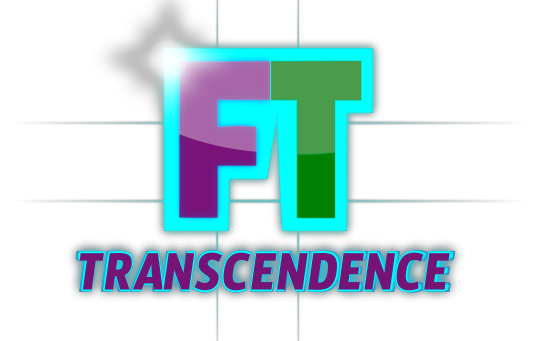
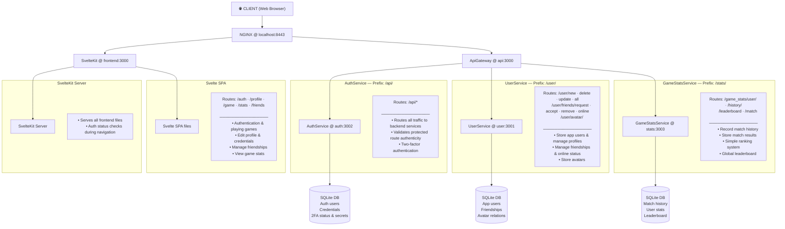
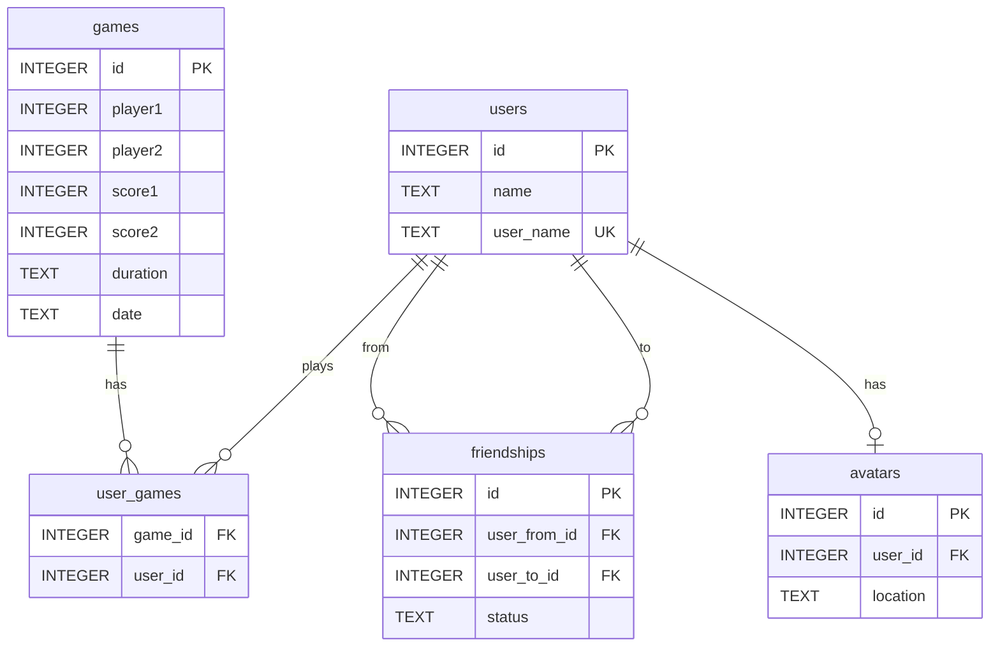
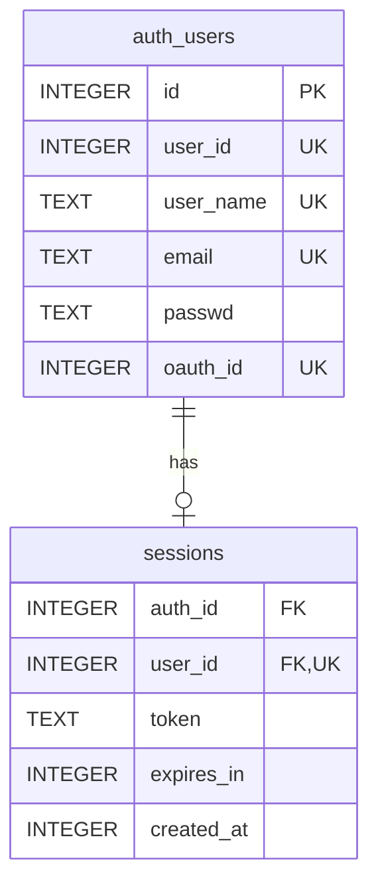
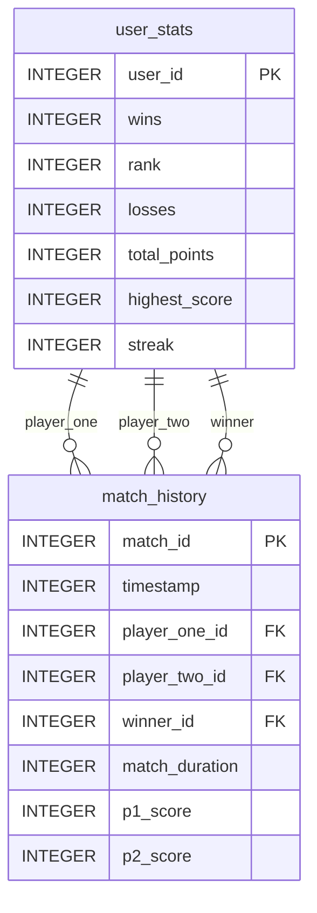

<div align="center">



_This project has been created as part of the 42 curriculum by [vvobis](https://github.com/vman101), [shaintha](https://github.com/StephanHainthaler), [khuk](https://github.com/catherine21550), [pgober](https://github.com/krissiliv), [juitz](https://github.com/JayuSC2)._

</div>

## Table of Contents

- [Description](#description)
- [Features & Modules](#features--modules)
  - [Decision against certain Modules](#decision-against-certain-modules)
- [Roles & Team Information](#roles-team-information--individual-contributions)
- [Project Management & Team Collaboration](#project-management--team-collaboration)
- [Architecture & Microservices](#architecture--microservices)
- [Database Schema](#database-schema)
  - [User Service Database](#1-user-service-database-servicesuser)
  - [Authentication Service Database](#2-authentication-service-database-servicesauth)
  - [Game Stats Service Database](#3-game-stats-service-database-servicesgame_stats)
- [Instructions](#instructions)
  - [Prerequisites](#prerequisites)
  - [Setup & Configuration](#setup--configuration)
  - [Installation](#installation)
  - [Running the Project](#running-the-project)
- [Resources](#resources)

## Description

**ft_transcendence** is the final project of Coding School 42. It is a full-stack web application where players can play Pong with features including user authentication, real-time multiplayer games, tournament systems and AI opponents.

The project's goal is to enhance skills in full-stack development, team organization, project management, and establishing roles within the team.

We called our project KhukVvobisPgoberShainthaJuitz - a mix of our intra names.

## Features & Modules

| **Module**           | **Sub Module**            |**Technologies / Frameworks**| **Assignee**    | **Type**| **Points** | **Feature Description (if applicable)** |  **Why we chose it**            |
| :---                 | :---                      |  :---              | :---            | :---    | :---       | :---       |   :---                    |
| **Web**              |                           |                    |                 |         |            |            |                           |
| `-`                  | Frontend Framework        | - [Svelte](https://svelte.dev/)<br> - [Vite](https://vite.dev/guide/)<br> - [TypeScript](https://www.typescriptlang.org/docs/handbook/typescript-in-5-minutes.html)<br> - [Tailwind CSS](https://v2.tailwindcss.com/docs)<br> - [shadcn-Svelte](https://www.shadcn-svelte.com/) | everyone        | Minor   | 1          | n.a.        |  - Svelte is simple & fast<br> - Vite makes development quick with instant updates<br> - TypeScript catches bugs early<br> - Tailwind for styling<br> - shadcn/svelte provides pre-built components |
| `-`                  | Backend Framework         | - [Fastify](https://fastify.dev/docs/latest/)<br> -[TypeScript](https://www.typescriptlang.org/docs/handbook/typescript-in-5-minutes.html)<br> - [Node.js](https://nodejs.org/docs/latest/api/) | everyone        | Minor   | 1          | n.a.        |  - Fastify is quick & good for building separate services<br> - TypeScript helps avoid mistakes with data types |
| `-`                  | ORM Database              | - Custom ORM<br> - [SQLite](https://www.sqlite.org/docs.html) via better-sqlite3 | vvobis          | Minor   | 1          | n.a.        |  - Custom ORM keeps us in control & type-safe<br> - SQLite is simple to use & works everywhere|
| `-`                  | Custom-made design system              | - [shadcn-Svelte](https://www.shadcn-svelte.com/)<br> - [TypeScript](https://www.typescriptlang.org/docs/handbook/typescript-in-5-minutes.html)<br> - [Tailwind CSS](https://v2.tailwindcss.com/docs)<br> - [Lucide Icons](https://lucide.dev/)<br> - [Inkscape](https://inkscape.org/)<br> | khuk          | Minor   | 1          |  n.a.        |  - Provides a consistent visual language with accessible, reusable components and unified iconography |
| **Accessibility**    |                           |                    |                 |         |            |            |                           |
| `-`                  | Language Support          | - [shadcn-Svelte](https://www.shadcn-svelte.com/) localization support | khuk            | Minor   | 1          | n.a.        |  - Multi-lingual team |
| `-`                  | Browser compatibility       | - worked automatically | everyone        | Minor   | 1          | n.a.        |  - Vite handles older browsers automatically<br> - Tailwind CSS works the same everywhere |
| **User Management**  |                           |                    |                 |         |            |            |                           |
| `-`                  | Standard user management  | - [SQLite](https://www.sqlite.org/docs.html)<br> - REST API ([Fastify](https://fastify.dev/docs/latest/Reference/))<br> - [TypeScript](https://www.typescriptlang.org/docs/handbook/typescript-in-5-minutes.html) | vvobis          | Major   | 2          | n.a.        |  - SQLite keeps data safe & consistent<br> - REST API is simple to use<br> - TypeScript prevents errors when handling user data<br>- Avatar Upload<br>- Profile Management|
| `-`                  | Game stats                | - [SQLite](https://www.sqlite.org/docs.html) (Game Stats Service) | khuk            | Minor   | 1          | n.a.        |  - Separate database for stats so the user service doesn't get slowed down |
| `-`                  | Remote authentication     | - [OAuth 2.0 (GitHub)](https://docs.github.com/en/apps/oauth-apps) | pgober          | Minor   | 1          | n.a.        |  - GitHub OAuth makes login easier for users<br> |
| `-`                  | JWT & 2FA               | - [JWT](https://www.jwt.io/) (RS256 signing)<br> - [2FA](https://docs.github.com/en/authentication/securing-your-account-with-two-factor-authentication-2fa/configuring-two-factor-authentication) | vvobis, juitz, khuk  | Minor   | 1          | n.a.        |  - Encodes User Information as JWT in cookie for authentication<br> - 2FA adds extra security when needed |
|**AI-Algorithm**      |                           |                    |                 |         |            |            |                           |
| `-`                  | AI Opponent               | - Mathematical Algorithm | pgober          | Major   | 2          | difficulty can be chosen in game settings        |  - Math-based AI is simple & fair<br> -  no need for complex ML |
| **Gaming**           |                           |                    |                 |         |            |            |                           |
| `-`                  | Web-based game            | - [Canvas API](https://developer.mozilla.org/en-US/docs/Web/API/Canvas_API)<br> | shaintha & juitz| Major   | 2          | simple 2-player implementation of a PONG game with setable score & duration  |  - Canvas is the standard way to draw games in browsers<br> |
| `-`                  | Tournament system         | - [SQLite](https://www.sqlite.org/docs.html) storage<br> | vvobis          | Minor   | 1          | n.a.        |  - Automatic bracket generation handles any number of even players<br>- Local tournament matches |
| **DevOps**           |                           |                    |                 |         |            |            |                           |
| `-`                  | Backend as microservices  | - [Nginx](https://nginx.org/en/docs/) reverse proxy<br> - [Fastify](https://fastify.dev/docs/latest/Reference/) services | everyone        | Major   | 2          | n.a.        |  - Microservices let each person work on their own part independently<br> - Nginx puts everything together |
| **Modules of Choice**|                           |                    |                 |         |            |            |                           |
| `-`                  | Custom ORM                | - [SQLite](https://www.sqlite.org/docs.html) bindings | vvobis          | Minor   | 1          | n.a.        |  - Custom ORM gives us type safety without being complicated<br>- Handles Table creation, deletion, query, insert and update |
| **TOTAL**            |                           |                    |                 |         | _19_       |            |                           |


#### Decision against certain Modules

| Category | Notes |
|--------|-------|
| Web | - Blockchain too much of a hassle to learn (I think) |
| Gaming | - Customization could be fairly easy, but maybe annoying as well<br> - Live chat seems very complicated, but also very interesting<br> - **NOTE:** Game might be best done by one person, except live chat maybe |
| DevOps | - Other modules too much |

## Roles, Team Information & Individual Contributions
  
| **Person** | **Role**                                    | **Responsibilities**                        | **Individual Contributions** | **Challenges & Solutions** |
|:-----------|:--------------------------------------------|:--------------------|:----------------------------|:--------------------------------------------------|
| vvobis     | Product Owner / Technical Lead / Full-stack Developer, DevOps Engineer | Decision on features and priorities, Validate completed work & Review critical code changes, Make technology stack decisions   | Custom ORM, User Service, Tournament System, JWT & 2FA, Global Error Handling, Containerization & Deployment | - ORM type safety<br> > TypeScript generics<br> - JWT cross-service auth<br> > RS256 asymmetric signing<br> |
| shaintha   | Scrum Master / Developer                    | Organization of team meetings, Ensure team communication, Policy and Terms (incl. translation) | Pong Game mechanics, Canvas rendering, Game physics, Game Pages Design | - game physics (velocity & collision with paddles)<br> > proper entity collisions & checks before movement<br> - design of user interface of the game associated pages<br> > usage of GridCards, Dialogues and tables |
| khuk       | Full-stack Developer   | Write code for assigned features, Testing. Design and implementation of analytical services | Game Stats Microservice, Leaderboard ranking, Persistent Language Support (UKR/EN/DE), UI/UX Stability logic, Global Error Handling & ORM utility enhancements, 2FA | - Stats isolation<br> > separate microservice<br> - UX Persistence<br> - UI Fallbacks<br> > centralized error interceptors & default i18n values |
| pgober     | Developer                                   | Write code for assigned features, Testing, Documentation, Policy and Terms (incl. translation) | OAuth 2.0 (GitHub), AI Opponent algorithm, Language Support (help with german translations), Documentation | - OAuth secrets exposure<br> > env variables<br> - AI fairness<br> > mathematical algorithm vs ML complexity |
| juitz      | Developer                                   | Write code for assigned features, Testing  | Web game (Canvas/WebSocket), 2FA | - gameplay consistency<br> > delta-time updates + resize scaling for stable speed<br> - account security<br> > end-to-end TOTP 2FA flow (secure setup, verification, login challenge) |

For more information on the individual contributions, you can also check the Modules table above.


## Architecture & Microservices

Our application follows a **microservices architecture** with the following components:


## Database Schema

There are three separate SQLite databases managed by microservices:

### 1. User Service Database (`services/user`)

Manages user accounts, profiles, avatars, games, and friend relationships.

**Tables:**


**Key Relationships:**
```
users
  ├── 1:1 → avatars (one user can have one avatar)
  ├── 1:N → friendships (user can have many friendships)
  └── M:N → games (via user_games junction table)
```

### 2. Authentication Service Database (`services/auth`)

Handles user authentication, sessions and OAuth.

**Tables:**



**Key Relationships:**
```
auth_users
  └── 1:N → sessions (one user can have multiple active sessions)
```

### 3. Game Stats Service Database (`services/game_stats`)

Tracks player statistics, rankings, and match history.

**Tables:**



**Key Relationships:**
```
user_stats
  └── 1:N → match_history (one player can have many matches)

match_history references three user_stats records:
  ├── player_one_id → user_stats
  ├── player_two_id → user_stats
  └── winner_id → user_stats
```

## Instructions

### Prerequisites

Before you can run this project, ensure you have the following installed on your system:

#### Required Software & Tools

| Software | Version | Purpose | Installation |
|----------|---------|---------|--------------|
| **Node.js** | >= 18.x | JavaScript runtime for backend and build tools | [nodejs.org](https://nodejs.org/en/download) |
| **npm** | >= 9.x | Node Package Manager | Included with Node.js |
| **nvm** (optional) | Latest | Node Version Manager for managing multiple Node versions | [nvm-sh/nvm](https://github.com/nvm-sh/nvm) |
| **Docker** | >= 20.x | Container runtime | [docker.com](https://www.docker.com/products/docker-desktop) |
| **Docker Compose** | >= 2.x | Containerization | [docker.com](https://docs.docker.com/compose/install/) |
| **Make** | >= 4.x | Build automation tool | Pre-installed on macOS/Linux; [GnuWin32](http://gnuwin32.sourceforge.net/packages/make.htm) for Windows |
| **Git** | >= 2.x | Version control | [git-scm.com](https://git-scm.com/) |

### Setup & Configuration

#### Step 1: Clone the Repository

```sh
git clone https://github.com/StephanHainthaler/ft_transcendence.git
cd ft_transcendence
```

#### Step 2: Create .env Files

Create the following .env files with the specified variables in both `env/dev/` and `env/prod/` directories:

| Filename | Directory | Description | Variables |
|:---------|:----------|:------------|:----------|
| .env.api | env/dev/, env/prod/ | API Gateway service (Port: 3000) | <ul><li>HTTP_PROTOCOL</li><li>USER_SERVICE_URL</li><li>AUTH_SERVICE_URL</li><li>GAME_STATS_SERVICE_URL</li></ul> |
| .env.auth | env/dev/, env/prod/ | Authentication (Port: 3002) | <ul><li>HTTP_PROTOCOL</li><li>DB_PATH</li><li>USER_SERVICE_URL</li><li>GITHUB_APP_CLIENT_ID</li><li>GITHUB_APP_CLIENT_SECRET</li><li>GITHUB_REDIRECT_URL</li></ul> |
| .env.user | env/dev/, env/prod/ | User Service (Port: 3001) | <ul><li>HTTP_PROTOCOL</li><li>DB_PATH</li><li>AUTH_SERVICE_URL</li><li>DATA_DIR</li><li>AVATAR_DIR</li></ul> |
| .env.game_stats | env/dev/, env/prod/ | Game Stats Service (Port: 3003) | <ul><li>HOST</li><li>PORT</li><li>DB_PATH</li></ul> |


#### Step 3: GitHub OAuth Configuration

For OAuth 2.0 authentication to work, follow the [instructions in the GitHub Docs](https://docs.github.com/en/apps/oauth-apps/building-oauth-apps/creating-an-oauth-app).

### Installation

#### Step 4: Install Dependencies

Run the installation command at the root of the project:

```sh
make install
```

This command will:
- Install all npm dependencies listed in root `package.json`
- Install dependencies for all services (`services/*/package.json`)
- Install frontend dependencies (`frontend/package.json`)
- Install shared dependencies (`shared/package.json`)

**Note on npm:** npm is the Node Package Manager and the main utility for installing JavaScript modules. The `package.json` files specify which dependencies each service requires.

#### Step 5: Sync Dependencies After Pull

If you pull changes from `main` that include new dependencies:

```sh
make install
```

This ensures all new dependencies are installed locally.

#### Adding New Dependencies

To add a new package to a service:

```sh
cd services/<service-name>
npm install package-name
```

Or at the root for shared dependencies:

```sh
npm install package-name
```

### Running the Project

#### Development Mode

Start the development environment with automatic reloading:

```sh
make dev
```

or simply:

```sh
make
```

This will:
- Start **Vite** development server for the frontend at **http://localhost:8080**
- Hot Module Replacement (HMR) enabled for instant code updates
- Start all backend services in development mode with auto-restart on file changes:
  - API Gateway at `http://localhost:3000`
  - User Service at `http://localhost:3001`
  - Auth Service at `http://localhost:3002`
  - Game Stats Service at `http://localhost:3003`
- Transpile TypeScript to JavaScript automatically
- Compile Tailwind CSS utilities dynamically

#### Production Mode

Build and run the application in Docker containers:

```sh
make prod
```

#### Testing

Run the full test suite:

```sh
make test
```

## Project Management & Team Collaboration

We had regular meetings planned by shaintha as our Scrum Master. The whole communication was via Discord, where we also decided on meeting dates and schedules. During the meetings, we discussed task distribution and assignments which will be due in the next meetings. 

We also used GitHub Issues for this, where we created tickets and assigned them to the respective team member(s). More information on who contributed what in the end can be found in sections "Roles & Team Information" as well as in the above Module table.

### Collaboration Agreement
Before a PR to main, a test should have been written for the change. A change does not have to be a full module, might be just a part of a module or feature.
Also, if a new module was started / submitted, it should have a corresponding service entry in the docker compose and docker file in the service directory.

Workflow:
- pull changes from main into current working branch after every commit/merge to main
- run ```make install``` to sync dependencies
- run ```make test``` to check if all tests work after commit to main
- run ```make prod``` to check the docker setup runs
- work & write tests for changes
- when ready for PR, first run ```make test``` to run old and new tests
- if all goes well, run ```make prod``` to see that all builds as expected
- push to the remote branch and create a PR with a description of the changes
- some other group member reviews the PR (can be requested with GitHub feature)
- the PR gets merged and the group is notified
- everybody pulls from main to sync new feature
- start from top

## Resources

#### Svelte
- [Svelte](https://svelte.dev/)
- [shadcn-Svelte](https://www.shadcn-svelte.com/)
- [Svelte/store](https://svelte.dev/docs/svelte/svelte-store)

#### OAuth
- [Authorizing OAuth apps in GitHub](https://docs.github.com/en/apps/oauth-apps/building-oauth-apps/authorizing-oauth-apps#web-application-flow)
- [Creating an OAuth app in GitHub](https://docs.github.com/en/apps/oauth-apps/building-oauth-apps/creating-an-oauth-app)
- [Accessing GitHub API](https://medium.com/@tony.infisical/guide-to-using-oauth-2-0-to-access-github-api-818383862591)
- [Users via GitHub API](https://docs.github.com/en/rest/users/users?apiVersion=2022-11-28)
- [Scopes for OAuth apps](https://docs.github.com/en/apps/oauth-apps/building-oauth-apps/scopes-for-oauth-apps)

#### Fastify
- [Fastify Documentation](https://fastify.dev/docs/latest/)
- [Fastify Getting-Started](https://fastify.dev/docs/latest/Guides/Getting-Started/)
- [Fastify: Hooks](https://fastify.dev/docs/latest/Reference/Hooks/)
- [Fastify Route Parameters](https://fastify.dev/docs/latest/Reference/Routes/)

#### Tools / Frameworks / etc.
- [The TypeScript Handbook](https://www.typescriptlang.org/docs/handbook/intro.html)
- [Node.js SQLite Tutorial](https://www.sqlitetutorial.net/sqlite-nodejs/)
- [Using fetch with TypeScript](https://kentcdodds.com/blog/using-fetch-with-type-script)
- [MDN: HTTP Response Status Codes](https://developer.mozilla.org/en-US/docs/Web/HTTP/Status) — Reference for the global error interceptors

#### Design tools
- [Inkscape](https://inkscape.org/) — Open-source professional vector graphics software for UI design elements
- [OKLCH Color Picker & Converter](https://oklch.com/)
- [Lucide icons](https://lucide.dev/)

#### AI Usage

**GitHub Copilot** for checking the understandability and completeness of the Readme documentation.
